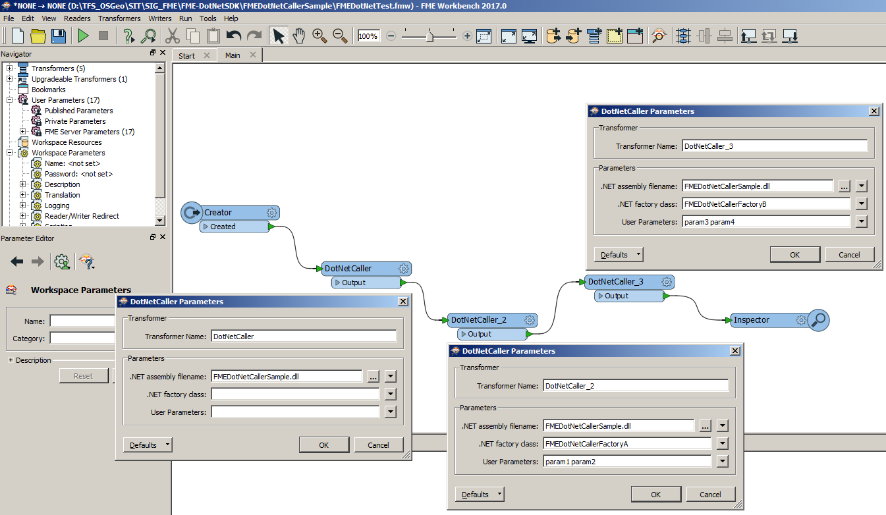
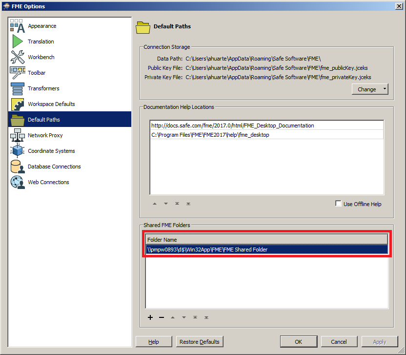
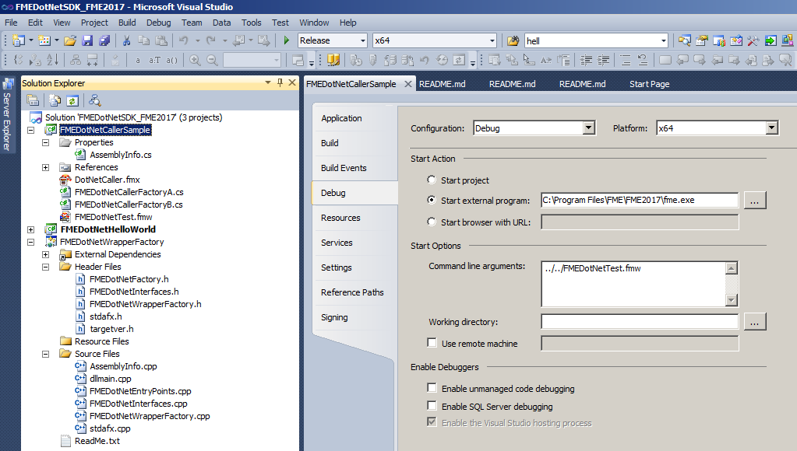

# FME-DotNetSDK DotNetCaller sample
Provides a Custom Transformer to execute .NET modules for the [FME-DotNet SDK](../README.md). It allows to configure the .NET assembly to run and the parameters to inject.

This sample provides two components, the .NET assembly, and its FME transformer definition file (.FMX)
to describe it. See [Custom Transformer documentation](https://docs.safe.com/fme/html/FME_Desktop_Documentation/FME_Workbench/Workbench/custom_transformer_creating.htm) to learn about it.

  

The Custom Transformer allows you run any .NET assembly implementing a Factory of the FME-DotNet SDK. You can configure the assembly to reference,
the Factory Name to run, and the arguments to pass to the Factory.

The transformer definition file (.FMX) is generic and you can share it for other similar modules.

## How to build

* Build and/or deploy the [SDK](../README.md).
* Open the project file, or solution file in root folder, and click build.

## How to deploy

If you didn't before, copy the **FMEDotNetWrapperFactory.dll** file to your FME plugins folder (e.g. *%PROGRAMFILES%\FME\FME2017\plugins*).

Copy the .NET Assembly and the FMX file to a valid shared *Transformers* folder.

You can define your own *Transformers* folder setting *MENU -> Tools -> FME Options...*

  

Then, by example:
* copy .\DotNetCaller.fmx          "C:\My Shared Resources Directory\Transformers\"
* copy .\FMEDotNetCallerSample.dll "C:\My Shared Resources Directory\Transformers\"

or
* copy .\DotNetCaller.fmx          "C:\Program Files\FME\FME2017\Transformers\"
* copy .\FMEDotNetCallerSample.dll "C:\Program Files\FME\FME2017\Transformers\"

If you want to deploy the Custom Transformer to FME Server, you have to do similar steps.

## How to debug

Create a FME Workbench workflow (.FMW file) with the Custom Transformer, and define the DEBUG configuration in Visual Studio:

  

Set breakpoints and run it.

