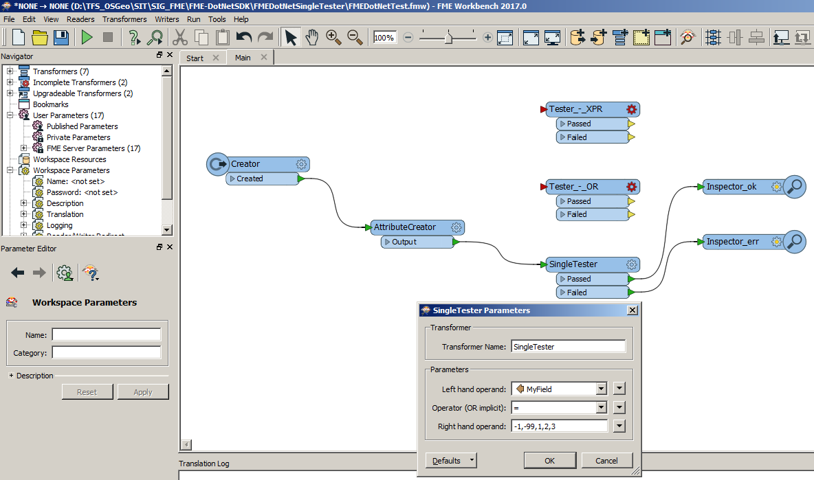
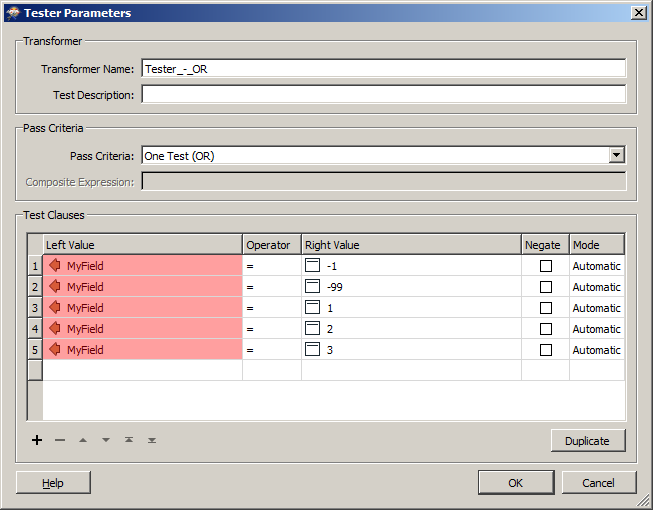
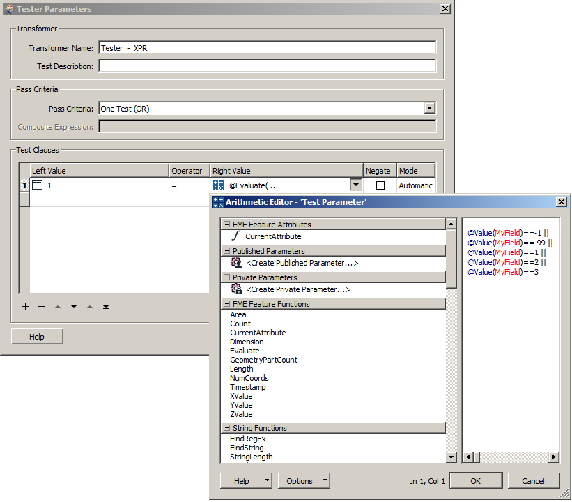
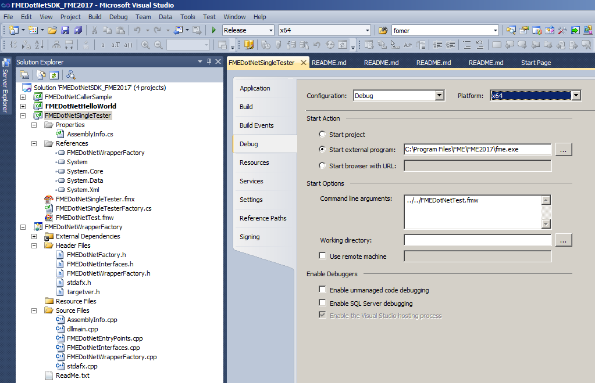

# FME-DotNetSDK SingleTester sample
Implements a new [Tester Transformer](https://www.safe.com/transformers/tester/) for the [FME-DotNet SDK](../README.md). It is much faster than other equivalent Transformers.

This sample provides two components, the .NET assembly, and its FME transformer definition file (.FMX)
to describe it. See [Custom Transformer documentation](https://docs.safe.com/fme/html/FME_Desktop_Documentation/FME_Workbench/Workbench/custom_transformer_creating.htm) to learn about it.

  

The Custom Transformer evaluates one or more tests on a feature, and routes the feature according to the outcome of the test(s).
The tests can consist of any FME-allowed operands.

This module executes the tests similar than you would create with other existing FME Transformers:

  

  

  But it runs much faster than them!

## How to build

* Build and/or deploy the [SDK](../README.md).
* Open the project file, or solution file in root folder, and click build.

## How to deploy

If you didn't before, copy the **FMEDotNetWrapperFactory.dll** file to your FME plugins folder (e.g. *%PROGRAMFILES%\FME\FME2017\plugins*).

Copy the .NET Assembly and the FMX file to a valid shared *Transformers* folder.

You can define your own *Transformers* folder setting *MENU -> Tools -> FME Options...*

  

Then, by example:
* copy .\FMEDotNetSingleTester.fmx "C:\My Shared Resources Directory\Transformers\"
* copy .\FMEDotNetSingleTester.dll "C:\My Shared Resources Directory\Transformers\"

or
* copy .\FMEDotNetSingleTester.fmx "C:\Program Files\FME\FME2017\Transformers\"
* copy .\FMEDotNetSingleTester.dll "C:\Program Files\FME\FME2017\Transformers\"

If you want to deploy the Custom Transformer to FME Server, you have to do similar steps.

## How to debug

Create a FME Workbench workflow (.FMW file) with the Custom Transformer, and define the DEBUG configuration in Visual Studio:

  

Set breakpoints and run it.

