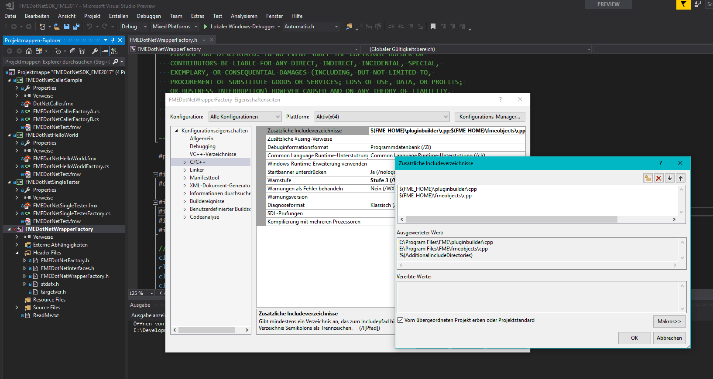

# FME-DotNetSDK
DotNet SDK enables to execute .NET modules in [FME](https://www.safe.com/) Workbench workflows.

The FME-DotNet SDK provides a C++/CLI DLL to develop FME transformers for the [FME platform](https://www.safe.com/how-it-works/) using .NET code.
You can easily develop any .NET assembly in order to implement your own specific funcionality.
These assemblies can be integrated in FME Workbench workflows as usual, and by using any combination of them.

If you need to use the Microsoft .NET platform, or develop fast FME Transformers (The .NET assemblies run 
much faster than equivalent python-based FME Transformers), this is your SDK!

The C++/CLI DLL provides a set of classes, to reference in your own .NET assembly, which you can use
to read and create the features managed in the current running FME workflow. You can read all
attributes of the features from input data sources and write new features to output as you need.
These classes act as a simple wrapper from original C++ classes in the [FME Plug-in SDK](https://knowledge.safe.com/articles/797/developing-a-new-transformer-using-the-fme-plug-in.html) 
that FME plaftorm provides. This SDK has been succesfully tested for 2015, 2016 and 2017 versions 
and both x86 and x64 architectures.

You have to create two components, the .NET assembly, of course, and its FME transformer definition file (.FMX)
to describe your new [Custom Transformer](https://docs.safe.com/fme/html/FME_Desktop_Documentation/FME_Workbench/Workbench/custom_transformer_creating.htm).

## How to build

* Download and install the [FME Plug-in SDK](https://knowledge.safe.com/articles/797/developing-a-new-transformer-using-the-fme-plug-in.html).
* Open the solution file in root folder and build your desired architecture (x86 or x64).

  The C++/CLI project defines an additional include directory to folder where the FME Plug-in SDK is located. 
  By default, it targets to *%PROGRAMFILES%\FME\FME2017\plugins* path, you will have to change it 
  if you have other installation path.

  

  If you don't want to build the SDK, you can copy the desired binary from [Redist folder](./Redist/plugins).

## How to deploy

Copy the **FMEDotNetWrapperFactory.dll** file to your FME plugins folder (e.g. *%PROGRAMFILES%\FME\FME2017\plugins*).
Now, you can create, execute and debug your own Custom Transformer with .NET code!

